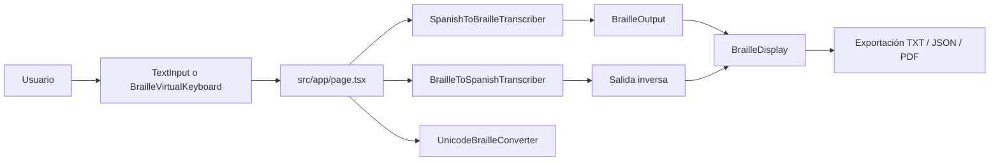

# Documentación Técnica de la Segunda Versión

## 1. Contexto del proyecto

Esta documentación corresponde a la segunda versión del proyecto de transcripción entre español y Braille. La primera versión sirvió como base conceptual y de tipado; la versión actual amplía la solución con una estructura de interfaz más completa, un flujo inverso Braille -> español, exportación de resultados y soporte para entrada manual mediante teclado Braille virtual.

El proyecto se implementa como una aplicación web con **Next.js 14**, **React 18**, **TypeScript 5.4** y **Tailwind CSS 3.4**. Toda la lógica de negocio se ejecuta en el cliente.

### Objetivos funcionales

- Transcribir texto español a Braille.
- Convertir Braille a texto español.
- Aceptar entrada en formato binario, Unicode Braille y teclado virtual.
- Exportar resultados en texto, JSON y PDF.
- Proveer validación, estadísticas y retroalimentación visual al usuario.

## 2. Visión general de la arquitectura

### 2.1 Capas del sistema

La solución se organiza en cuatro capas claras:

1. **Presentación**: componentes React en `src/app/` y `src/components/`.
2. **Lógica de dominio**: transcriptores y convertidores en `src/lib/`.
3. **Contratos de datos**: tipos e interfaces en `src/types/`.
4. **Soporte y utilidades**: helpers en `src/utils/`.

### 2.2 Principio de diseño

La implementación sigue un patrón de separación de responsabilidades. Los componentes de interfaz no contienen reglas Braille complejas; en su lugar delegan la lógica al módulo de dominio. Esto facilita pruebas, mantenimiento y futuras extensiones.

### 2.3 Flujo principal



## 3. Estructura técnica del repositorio

### 3.1 Carpetas funcionales

- `src/app/`: layout global y página principal.
- `src/components/`: componentes visuales reutilizables.
- `src/components/braille/`: componentes especializados para Braille.
- `src/components/ui/`: primitivas de UI.
- `src/lib/`: motor de transcripción y conversores.
- `src/types/`: tipos compartidos.
- `src/utils/`: utilidades generales.
- `tests/`: pruebas automatizadas.
- `Dumentacion/`: documentación del proyecto.

### 3.2 Archivos de configuración

- `package.json`
- `tsconfig.json`
- `next.config.js`
- `postcss.config.js`
- `tailwind.config.js`
- `jest.config.js`
- `jest.setup.js`

## 4. Stack tecnológico

### 4.1 Dependencias de ejecución

- `next`: framework principal.
- `react` y `react-dom`: interfaz y rendering.
- `jspdf`: exportación a PDF.
- `lucide-react`: iconos.
- `@radix-ui/react-slot`: composición de componentes.
- `class-variance-authority`, `clsx`, `tailwind-merge`: gestión de clases CSS.
- `tailwindcss-animate`: animaciones de utilidad.

### 4.2 Dependencias de desarrollo

- `typescript`
- `eslint` y `eslint-config-next`
- `jest`
- `babel-jest`
- `@testing-library/react`
- `@testing-library/jest-dom`
- `@types/node`, `@types/react`, `@types/react-dom`, `@types/jest`
- `postcss`
- `autoprefixer`

## 5. Configuración base de la aplicación

### 5.1 Layout global

Archivo: `src/app/layout.tsx`

El layout global define:

- idioma del documento en español,
- carga de la fuente Inter,
- clases globales para antialiasing y fondo,
- estructura raíz del documento HTML.

### 5.2 Metadata global

La metadata actual expone:

- título: Proyecto Primer Bimestre,
- descripción: proyecto web desarrollado para el primer bimestre de Construcción de Software.

### 5.3 Configuración de Next.js

`next.config.js` contiene:

- dominios de imágenes permitidos,
- variables de entorno estáticas.

### 5.4 TypeScript

`tsconfig.json` está configurado con:

- `strict: true`,
- `noEmit: true`,
- `moduleResolution: bundler`,
- alias:
  - `@/*` -> `src/*`,
  - `@/components/*` -> `src/components/*`,
  - `@/utils/*` -> `src/utils/*`.

## 6. Contratos de datos

### 6.1 `BrailleDots`

```typescript
type BrailleDots = [boolean, boolean, boolean, boolean, boolean, boolean];
```

Representa una celda Braille de 6 puntos. El orden lógico es:

- índice 0: punto 1,
- índice 1: punto 2,
- índice 2: punto 3,
- índice 3: punto 4,
- índice 4: punto 5,
- índice 5: punto 6.

### 6.2 `BrailleSymbol`

```typescript
interface BrailleSymbol {
  dots: BrailleDots;
  character: string;
  description: string;
}
```

Se utiliza para describir cada símbolo Braille con su patrón, carácter asociado y nombre legible.

### 6.3 `TokenType`

```typescript
enum TokenType {
  LETTER = 'letter',
  NUMBER = 'number',
  ACCENTED_VOWEL = 'accented_vowel',
  PUNCTUATION = 'punctuation',
  SPACE = 'space',
  UNKNOWN = 'unknown'
}
```

Clasifica cada carácter durante la tokenización.

### 6.4 `Token`

```typescript
interface Token {
  character: string;
  type: TokenType;
  brailleSymbol?: BrailleSymbol;
  position: number;
}
```

Cada token conserva el carácter original, su tipo y, si aplica, el símbolo Braille resuelto.

### 6.5 `TranscriptionStatistics`

```typescript
interface TranscriptionStatistics {
  totalCharacters: number;
  totalSymbols: number;
  unrecognizedCharacters: number;
  processingTime: number;
}
```

### 6.6 `BrailleOutput`

```typescript
interface BrailleOutput {
  originalText: string;
  symbols: BrailleSymbol[];
  tokens: Token[];
  brailleText: string;
  statistics: TranscriptionStatistics;
}
```

### 6.7 `TranscriptionConfig`

```typescript
interface TranscriptionConfig {
  useContractions: boolean;
  displayMode: 'dots' | 'binary' | 'unicode';
  formatting: {
    preserveCase: boolean;
    preserveSpaces: boolean;
    maxLineLength?: number;
  };
}
```

La propiedad `useContractions` existe como contrato, pero en la versión actual no se observa una implementación funcional de contracciones Braille.

## 7. Lógica central de transcripción

## 7.1 `SpanishBrailleMapper`

Archivo: `src/lib/braille-mapper.ts`

### Responsabilidad

Mapear caracteres españoles a símbolos Braille y mantener el mapeo inverso desde los puntos hacia el carácter original.

### Estructuras internas

- `characterMap`: mapa de carácter a símbolo.
- `dotsMap`: mapa de patrón binario a carácter.

### Cobertura funcional

Incluye:

- alfabeto español completo en minúsculas y mayúsculas,
- `ñ` y `Ñ`,
- vocales acentuadas,
- `ü` y `Ü`,
- números del `0` al `9`,
- puntuación básica,
- indicadores numérico y de mayúscula.

### Métodos principales

- `getBrailleSymbol(character)`
- `hasMapping(character)`
- `getAllMappedCharacters()`
- `getNumberIndicator()`
- `getCapitalIndicator()`
- `isLetter(character)`
- `isNumber(character)`
- `isAccentedVowel(character)`
- `isPunctuation(character)`
- `getCharacterFromDots(dots)`
- `hasDotsMapping(dots)`

### Detalle técnico relevante

El mapeo de números usa la convención Braille estándar de los caracteres `a-j` precedidos por un indicador numérico. El indicador numérico y el de mayúscula se agregan como símbolos auxiliares durante la transcripción, no como parte del texto original.

## 7.2 `SpanishToBrailleTranscriber`

Archivo: `src/lib/braille-transcriber.ts`

### Responsabilidad

Convertir texto español en un objeto `BrailleOutput` completo.

### Secuencia de ejecución

1. Calcula tiempo de inicio.
2. Combina la configuración por defecto con la configuración recibida.
3. Valida la entrada.
4. Tokeniza el texto carácter por carácter.
5. Procesa tokens y agrega indicadores cuando aplica.
6. Resuelve cada carácter a su símbolo Braille.
7. Genera la representación visual con `dots`, `binary` o `unicode`.
8. Calcula estadísticas.
9. Retorna el resultado final.

### Métodos clave

- `transcribe(text, config?)`
- `validateInput(text)`
- `getLastStatistics()`
- `getUnrecognizedCharacters(text)`
- `getDetailedStatistics(text)`

### Reglas de procesamiento

#### Números

Cuando aparece el primer número de una secuencia se inserta un indicador numérico. Mientras continúan los dígitos, el transcriptor mantiene el modo numérico.

#### Mayúsculas

Si `preserveCase` está activo, se agrega un indicador de mayúscula antes de cada letra mayúscula o vocal acentuada mayúscula.

#### Puntuación

Los signos de puntuación válidos se conservan y se mapean a su patrón Braille correspondiente.

#### Espacios

Los espacios se tratan como tokens válidos y se preservan en la salida.

### Salida visual

El método interno `generateBrailleText()` produce:

- representación por puntos,
- representación binaria,
- representación Unicode.

## 7.3 `BrailleToSpanishTranscriber`

Archivo: `src/lib/braille-to-spanish-transcriber.ts`

### Responsabilidad

Reconstruir texto español a partir de símbolos Braille.

### Entrada soportada

- símbolos Braille como `BrailleDots`,
- secuencias binarias de 6 bits mediante `transcribeFromBinary()`.

### Reglas principales

- Reconoce indicador numérico y activa modo numérico.
- Reconoce indicador de mayúscula y capitaliza el siguiente carácter válido.
- Convierte los patrones de letras `a-j` en dígitos cuando el modo numérico está activo.
- Valida la entrada binaria con `validateBinaryInput()`.

### Resultado

Devuelve:

- texto Braille original en binario,
- texto español reconstruido,
- símbolos procesados,
- estadísticas de procesamiento.

## 7.4 `UnicodeBrailleConverter`

Archivo: `src/lib/unicode-braille-converter.ts`

### Responsabilidad

Convertir entre Unicode Braille y `BrailleDots`.

### Métodos

- `unicodeToDots(char)`
- `unicodeTextToDots(text)`
- `dotsToUnicode(dots)`
- `isUnicodeBraille(char)`
- `containsUnicodeBraille(text)`

### Utilidad práctica

Este módulo permite interpretar Braille Unicode pegado desde otras fuentes o generado desde el teclado virtual.

## 8. Componentes de interfaz

## 8.1 `src/app/page.tsx`

La página principal es un componente cliente que concentra el estado del flujo de la aplicación.

### Estado principal

- `conversionMode`
- `inputMethod`
- `inputText`
- `brailleSymbols`
- `transcriptionResult`
- `reverseTranscriptionResult`
- `isProcessing`
- `errors`
- `unsupportedCharacters`

### Responsabilidades

- coordinar el modo de conversión,
- decidir la fuente de entrada,
- invocar el transcriptor correspondiente,
- controlar errores,
- ejecutar exportaciones,
- distribuir resultados a los componentes visuales.

### Exportación

La página exporta el resultado Braille en tres formatos:

- texto plano,
- JSON,
- PDF con `jsPDF`.

### Observación técnica

La exportación PDF dibuja cada celda Braille en un formato visual apto para impresión. Además reubica los símbolos si se supera el espacio disponible de la página.

## 8.2 `TextInput`

Archivo: `src/components/braille/TextInput.tsx`

### Propósito

Gestionar la entrada de texto español a transcribir.

### Funcionalidades

- escritura manual,
- pegado de texto,
- carga de archivos `.txt`,
- validación de longitud máxima,
- inserción de texto de ejemplo,
- limpieza del campo,
- ejecución de transcripción con Enter.

### Comportamiento visual

El componente muestra:

- contadores de palabras y caracteres,
- alertas de validación,
- lista de caracteres no soportados,
- acciones rápidas para limpiar el contenido.

## 8.3 `BrailleDisplay`

Archivo: `src/components/braille/BrailleDisplay.tsx`

### Propósito

Visualizar el resultado de la transcripción Braille.

### Modos de vista

- `grid`: cuadrícula de celdas Braille.
- `list`: vista horizontal compacta.
- texto plano: representación textual del Braille.

### Controles locales

- modo de visualización,
- vista grid/list,
- panel de configuración,
- modo espejo para impresión.

### Funcionalidad de impresión

Genera una ventana aparte con HTML y CSS embebidos para imprimir la transcripción. El modo espejo invierte la disposición de puntos para facilitar el punzonado por el reverso.

### Estadísticas visibles

- caracteres totales,
- símbolos Braille,
- caracteres no reconocidos,
- tiempo de procesamiento.

## 8.4 `BrailleVirtualKeyboard`

Archivo: `src/components/braille/BrailleVirtualKeyboard.tsx`

### Propósito

Permitir la creación manual de celdas Braille activando puntos en una rejilla 2x3.

### Funcionalidades

- alternar puntos individuales,
- ver previsualización Unicode,
- agregar símbolo,
- borrar el último símbolo,
- limpiar todo.

### Integración

Usa `UnicodeBrailleConverter.dotsToUnicode()` para representar la celda activa y emitir tanto la estructura `BrailleDots` como el carácter Unicode correspondiente.

## 8.5 `BrailleSymbol`

Archivo: `src/components/braille/BrailleSymbol.tsx`

### Propósito

Renderizar un símbolo Braille individual.

### Modos de renderizado

- `dots`: celdas Braille visuales.
- `binary`: cadena de seis bits.
- `unicode`: marcador Unicode Braille.

### Características

- tamaños `sm`, `md`, `lg`,
- interacción opcional con teclado y clic,
- descripción accesible mediante `aria-label`,
- soporte visual para lectura rápida de patrones.

## 8.6 `Header`

Archivo: `src/components/Header.tsx`

### Propósito

Navegación principal del sitio.

### Comportamiento actual

- barra fija superior,
- navegación responsive,
- menú móvil,
- alternancia visual de modo oscuro,
- botón de acción principal.

### Observación técnica

El cambio de modo oscuro se aplica agregando o removiendo la clase `dark` sobre `document.documentElement`.

## 8.7 `Hero`

Archivo: `src/components/Hero.tsx`

### Propósito

Presentar la propuesta principal del sitio con una sección de bienvenida, llamados a la acción y métricas visuales.

### Elementos incluidos

- título principal,
- descripción general,
- botones de acción,
- tarjetas con métricas de diseño, rendimiento y accesibilidad.

## 8.8 `Features`

Archivo: `src/components/Features.tsx`

### Propósito

Mostrar una sección de características generales del proyecto.

### Contenido

- rendimiento,
- seguridad,
- diseño responsive,
- SEO,
- código limpio,
- UX centrada.

## 8.9 `Footer`

Archivo: `src/components/Footer.tsx`

### Propósito

Proveer información de contacto, enlaces rápidos y pie legal.

### Componentes visibles

- información institucional,
- enlaces rápidos,
- datos de contacto,
- enlaces sociales,
- políticas y términos.

## 8.10 `Button`

Archivo: `src/components/ui/Button.tsx`

### Propósito

Componente base reutilizable para botones.

### Características

- variantes visuales con `cva`,
- tamaños configurables,
- soporte para `asChild`,
- foco accesible,
- compatibilidad con composición usando `Slot`.

## 9. Función utilitaria

### `cn()`

Archivo: `src/utils/cn.ts`

Combina clases CSS y resuelve conflictos de Tailwind utilizando `clsx` y `tailwind-merge`.

Uso principal:

- composición dinámica de estilos,
- resolución de conflictos entre clases,
- simplificación de clases condicionales en componentes.

## 10. Flujo funcional de la aplicación

### 10.1 Conversión de español a Braille

1. El usuario escribe o carga texto.
2. `TextInput` valida el contenido.
3. La página principal invoca `SpanishToBrailleTranscriber`.
4. El texto se tokeniza.
5. Se insertan indicadores cuando aplica.
6. El mapeador resuelve símbolos Braille.
7. `BrailleDisplay` muestra el resultado.
8. El usuario puede exportar la salida.

### 10.2 Conversión de Braille a español

1. El usuario cambia el modo de conversión.
2. Ingresa Braille binario, Unicode o usa el teclado virtual.
3. La app normaliza la entrada a `BrailleDots`.
4. `BrailleToSpanishTranscriber` reconstruye el texto.
5. Se presentan estadísticas y salida final.

## 11. Pruebas

### 11.1 Herramientas

- `jest`
- `@testing-library/react`
- `@testing-library/jest-dom`
- `jest-environment-jsdom`

### 11.2 Cobertura existente

El archivo `tests/braille-transcriber.test.ts` cubre:

- transcripción básica,
- números,
- vocales acentuadas,
- mayúsculas,
- espacios,
- puntuación,
- caracteres especiales del español,
- validación de entrada,
- estadísticas,
- casos límite y de rendimiento.

### 11.3 Recomendaciones de cobertura futura

- pruebas para `BrailleToSpanishTranscriber`,
- pruebas para `UnicodeBrailleConverter`,
- pruebas de renderizado de componentes Braille,
- pruebas de exportación PDF y JSON,
- pruebas de navegación responsive.

## 12. Evolución respecto a la primera versión

La primera versión del documento se centraba principalmente en tipos, transcriptor y mapeador. La segunda versión del programa amplía el alcance con:

- conversión inversa de Braille a español,
- soporte para Unicode Braille,
- teclado Braille virtual,
- exportación a TXT, JSON y PDF,
- renderizado más rico de los símbolos,
- componentes de presentación más completos,
- pruebas automatizadas más amplias.

Además, algunas ideas del contrato original siguen presentes pero no completamente implementadas, como el soporte real de contracciones Braille.

## 13. Limitaciones actuales

### 13.1 Contracciones Braille

El contrato lo contempla, pero la lógica visible no aplica contracciones de forma operativa.

### 13.2 Persistencia de preferencias

No se observa persistencia de preferencias de usuario para el modo oscuro o configuraciones de vista.

### 13.3 Escalabilidad lingüística

El sistema está diseñado para un conjunto delimitado de caracteres y reglas. Si se amplía a otros idiomas o abreviaciones, será necesario extender el mapeo y las reglas de tokenización.

## 14. Recomendaciones técnicas


## 15. Estrategia de ramificación

La segunda versión conserva la estrategia de ramificación definida en la primera versión, porque sigue siendo la forma más estable de organizar el trabajo del equipo y mantener separada la documentación, la integración y las features funcionales.

### 15.1 Ramas principales del repositorio remoto

- `origin/main`:
  - rama estable principal del proyecto.
- `origin/develop`:
  - rama base de integración continua para el trabajo en progreso.
- `origin/documentacion`:
  - rama reservada para artefactos de documentación, manuales y especificaciones.

### 15.2 Ramas feature observadas en la segunda versión

- `origin/feature/marlon-entrada-braille`
  - asociada a la entrada principal y la composición de la interfaz.
- `origin/feature/martin-layout-principal`
  - enfocada en la estructura y layout principal.
- `origin/feature/andres-mapeo-braille`
  - orientada al mapeo y lógica Braille.
- `origin/feature/carlos-reglas-transcripcion`
  - enfocada en reglas y comportamiento de transcripción.
- `origin/feature/antony-resultados-exportacion`
  - asociada a visualización de resultados y exportación.
- `origin/incremento-branch`
  - rama auxiliar usada como incremento o consolidación temporal del trabajo.

### 15.3 Estrategia heredada de la primera versión

La documentación de la primera versión definía una estrategia basada en:

- `main` como rama estable,
- `develop` como rama de integración,
- `documentacion` como rama dedicada a artefactos documentales,
- ramas `feature/*` para trabajo aislado por funcionalidad o integrante.

Esa estrategia se mantiene en esta segunda versión porque facilita:

- aislar cambios de lógica Braille,
- separar trabajo de interfaz y documentación,
- reducir conflictos entre desarrolladores,
- validar cada incremento antes de integrar a `develop`,
- preservar una ruta clara de promoción hacia `main`.

### 15.4 Reglas de trabajo recomendadas

- Trabajar siempre desde `develop` para iniciar una nueva tarea.
- Crear una rama `feature/*` por cada cambio funcional o documental significativo.
- Mantener `documentacion` como rama exclusiva para archivos de documentación y artefactos de apoyo.
- Integrar primero los cambios de lógica y luego los de interfaz y exportación.
- Validar con pruebas y lint antes de fusionar a `develop` o `main`.


La segunda versión del proyecto consolida una solución frontend modular, con separación clara entre interfaz, lógica de conversión y contratos de datos. El resultado es una base sólida para uso académico y para futuras ampliaciones del sistema de transcripción Braille.